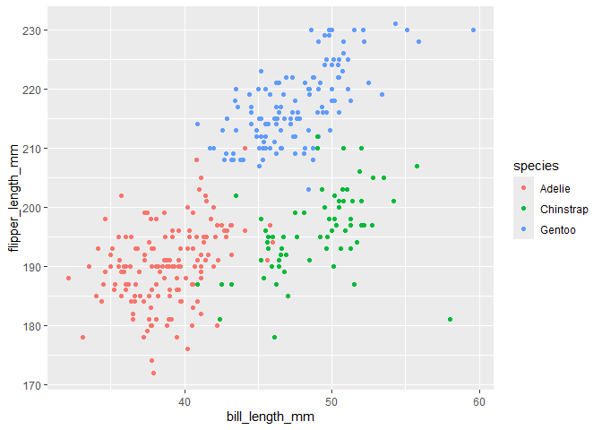

p8105_hw1_zl3804.Rmd
================
Eva/Zhuoxuan Li
2026-09-22

# Section 0

``` r
library(tidyverse)
```

    ## ── Attaching core tidyverse packages ──────────────────────── tidyverse 2.0.0 ──
    ## ✔ dplyr     1.2.1     ✔ readr     2.2.0
    ## ✔ forcats   1.0.1     ✔ stringr   1.6.0
    ## ✔ ggplot2   4.0.3     ✔ tibble    3.3.1
    ## ✔ lubridate 1.9.5     ✔ tidyr     1.3.2
    ## ✔ purrr     1.2.2     
    ## ── Conflicts ────────────────────────────────────────── tidyverse_conflicts() ──
    ## ✖ dplyr::filter() masks stats::filter()
    ## ✖ dplyr::lag()    masks stats::lag()
    ## ℹ Use the conflicted package (<http://conflicted.r-lib.org/>) to force all conflicts to become errors

# Section 1 download dataset from package

``` r
 data("penguins", package = "palmerpenguins")
```

This datasheet contains 344 subjects and 8 variables to describe the
dimensions of penguins, introducing us the year, species, island, sex of
those penguins, and bill_length_mm, bill_depth_mm, flipper_length_mm,
body_mass_g in relative measures. Among those, mean of their flipper
length is 200.9152047mm.

# Section 2 Make a scatterplot

``` r
ggplot(penguins, aes(x= bill_length_mm, y = flipper_length_mm, color = species)) + geom_point()
```

    ## Warning: Removed 2 rows containing missing values or values outside the scale range
    ## (`geom_point()`).

<!-- -->

``` r
ggsave("penguins_scatterplot.png")
```

    ## Saving 7 x 5 in image

    ## Warning: Removed 2 rows containing missing values or values outside the scale range
    ## (`geom_point()`).

# Section 3 Create dataframe

``` r
library(tidyverse)

set.seed(8130)

frame_samp = tibble(
  normx = rnorm (10),
  log_normx = normx > 0,
  character = c ("y", "o", "c", "o", "m", "p", "r", "o", "u", "n"),
  level = factor(sample(c("high", "medium", "low"), 10, replace = TRUE))
)  

mean_normx = mean(pull(frame_samp, normx))
mean_log_normx = mean(pull(frame_samp, log_normx))
mean_chara = mean(pull(frame_samp, character))
```

    ## Warning in mean.default(pull(frame_samp, character)): argument is not numeric
    ## or logical: returning NA

``` r
mean_level = mean(pull(frame_samp, level))
```

    ## Warning in mean.default(pull(frame_samp, level)): argument is not numeric or
    ## logical: returning NA

Show which variable can caculate means and which can’t :

The mean of normal distribution R.V. is -0.6682653

The mean of logic function outcome is 0.1

character and level can’t get means because the results are ‘NA’

# Section 4 Convert variable types

``` r
convert_log = as.numeric(pull(frame_samp,log_normx))
convert_chara = as.numeric(pull(frame_samp, character))
```

    ## Warning: NAs introduced by coercion

``` r
convert_fac = as.numeric(pull(frame_samp, level))
```

We can see when we do coercion, the warning said NAs are created:

logic type turned into 0, 1, 0, 0, 0, 0, 0, 0, 0, 0, which are meaning
numbers.

But characters showed up as NA, which aligns with the outcome that
characters can’t get a mean.

For factor type variable , although level can become numbers 3, 3, 1, 2,
2, 1, 3, 1, 2, 1after convertion, computers ban factor variables to
calculate means in order to prevent misunderstanding of mean of
categories.
